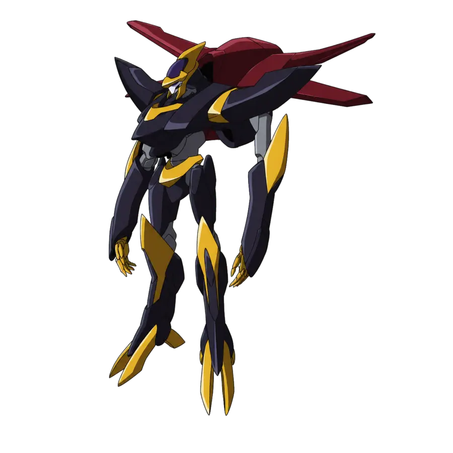
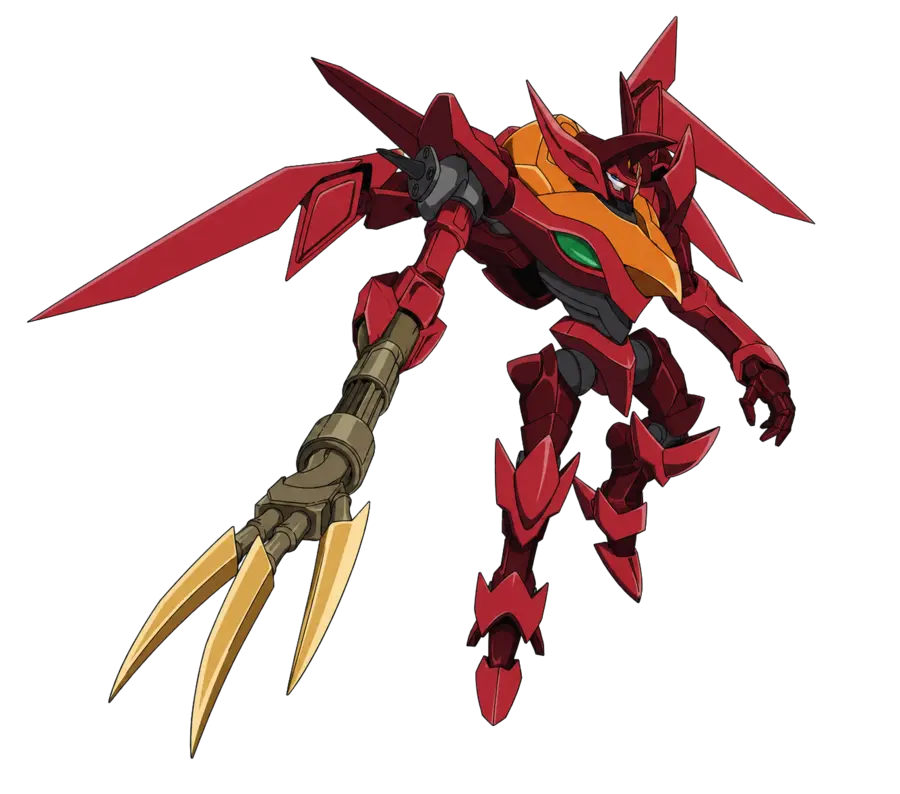
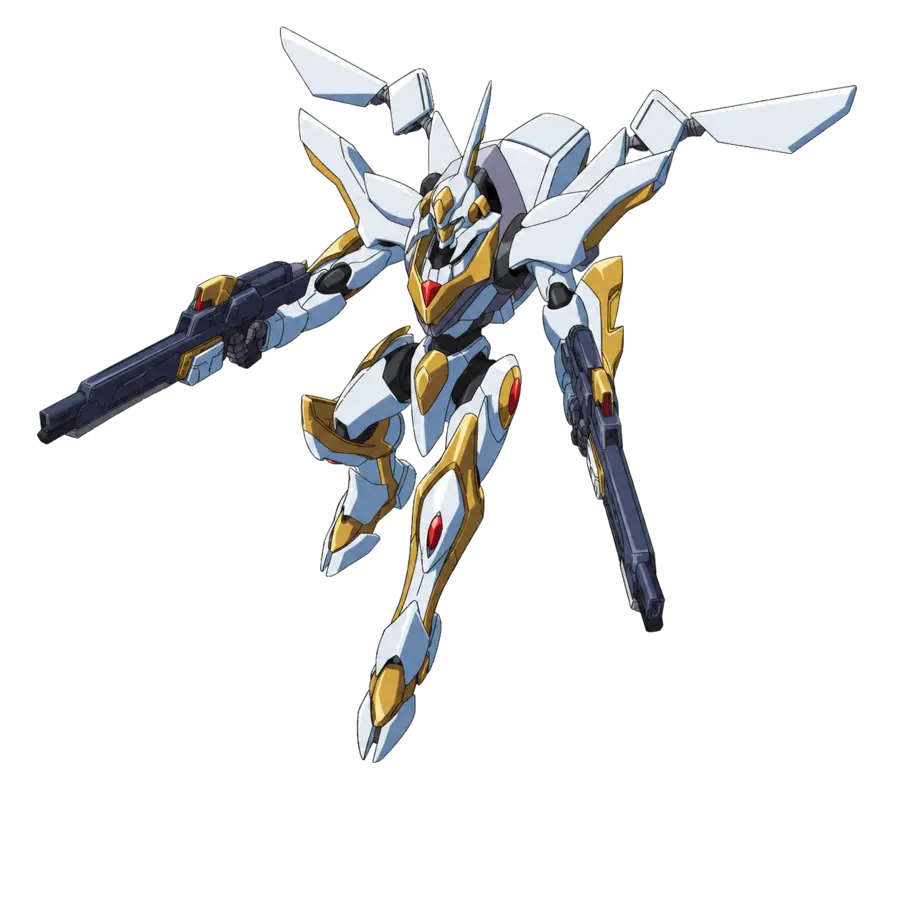

# CODE GEASS — REBELLION SURVIVORS

『コードギアス』のキャラクターとナイトメアフレームを題材にした、5分間の包囲戦を生き残るブラウザ向けサバイバルアクションゲームです。

## 🎮 公開版をプレイ

**[CODE GEASS — REBELLION SURVIVORSを起動する](https://code-geass-rebellion-survivors.shuten1106.chatgpt.site)**

PC・スマートフォン・タブレットのブラウザから、ログインなしでプレイできます。

## プレイアブルユニット

| パイロット | KMF | 主武装 | 固有システム |
|---|---|---|---|
| ルルーシュ・ランペルージ | 蜃気楼 | ハドロンショット | 絶対守護領域を周期展開し、接触した敵を防御・押し返し・攻撃 |
| 紅月カレン | 紅蓮聖天八極式 | 輻射波動機構 | 近距離の敵群を焼き切る高威力の範囲攻撃 |
| 枢木スザク | ランスロット・アルビオン | スーパーヴァリス | 複数照準射撃とMVS二刀による自動二連斬り |

| 蜃気楼 | 紅蓮聖天八極式 | ランスロット・アルビオン |
|:---:|:---:|:---:|
|  |  |  |

## 遊び方

- `WASD` または矢印キーで移動
- スマートフォン・タブレットでは画面左下の仮想スティックで移動
- 攻撃は自動で発動
- 敵が落とすサクラダイトを回収してレベルアップ
- レベルアップ時に3種類の強化候補から1つを選択
- BURSTゲージが満タンになったら `Space` または画面右下のボタンで固有BURSTを発動
- 5分間生存すると作戦完了

## ゲームの特徴

- キャラクターとKMFごとに異なる射撃・近接・防御アクション
- 固有武装の強化と最終進化
- 撃破チェインとスコアボーナス
- 衝撃波、斬撃軌道、ヒットフラッシュ、画面振動による爽快な戦闘演出
- 効果音、キーボード操作、タッチ操作に対応
- レスポンシブ表示に対応した1ページ完結型ゲーム

## 技術構成

- React 19
- TypeScript
- Vinext / Vite
- Canvas 2D
- Cloudflare Workers互換ビルド
- OpenAI Sitesで公開

ゲームの中心ロジックとCanvas描画は [`app/rebellion-survivors.tsx`](app/rebellion-survivors.tsx)、画面全体のスタイルは [`app/globals.css`](app/globals.css) に実装しています。

## ローカル実行

Node.js `22.13.0` 以上が必要です。

```bash
npm ci
npm run dev
```

開発サーバーの表示URLは起動時のメッセージを確認してください。Sites向けのビルド・検証補助スクリプトはBash環境を前提としています。

## ビルド

```bash
npm run build
```

## 免責事項

本作は個人制作の非公式ファンメイド作品です。『コードギアス』および関連する名称・キャラクター・メカニック等の権利は、各権利者に帰属します。本リポジトリおよび公開ゲームは、権利者各社とは関係ありません。
